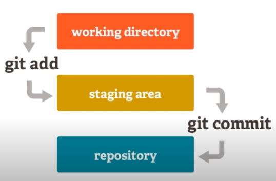
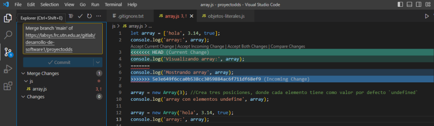

# Introducción a GIT

GIT es un VCS por sus siglas en inglés (Version Control System). El objetivo de un VCS es almacenar todos los cambios que se realizaron sobre un conjunto de archivos, generando así un historial de cambios, donde se puede ver cada modificación realizada en los archivos, y llegado el caso volver a una versión previa.

## Conceptos básicos

- **Commit o Parche**: Detalle de un cambio específico que se realizó a uno o más archivos bajo control de versiones. Tiene un autor asociado, una fecha y un comentario donde generalmente se describe que se cambió.
- **Repositorio**: Lugar donde se almacenan todo el historial de cambios.
- **Copia de trabajo**: Copia de los archivos bajo control de versiones, generalmente una carpeta, donde un programador hace los cambios en los archivos del proyecto y desde donde se generan los parches que van evolucionando el proyecto.

## Diferencia entre Git y GitHub

Mientras que Git es el VCS, GitHub es un servicio muy popular que permite crear repositorios Git en sus servidores. Algo similar sucede con Gitlab, Gogs o Bitbucket, que, al igual que Github, son otros servicios que permiten almacenar un repositorio en un servidor en internet.

## ¿Cómo funciona Git?

Cuando un programador participa en un proyecto de desarrollo de software descarga (clona) desde el servidor compartido el repositorio con los archivos del mismo, generando una copia local sobre la que trabajará. 

Una vez que el programador haya descargado (clonado) el repositorio trabajará sobre esta copia local agregando, modificando y eliminando archivos. Para Git los archivos estarán en uno de tres estados posibles: modificado, en staging (staged), confirmado (commited).

- **Modificado**: El archivo estará en este estado si, luego de haber sido descargado, se modificó. Por ejemplo, se clonó un proyecto y se modificó una línea de código de un archivo y esta modificación se guardó. Hasta este momento, para Git el archivo está en estado modificado, no se confirmó todavía este cambio, no se lo asoció a un autor, ni se guardó este cambio en el historial.
- **Staged**: El archivo estará en este estado si el programador decidió agregar sus modificaciones para que sean confirmadas en el próximo commit. Por ejemplo, el programador decide que la modificación en el archivo es correcta e indicó a Git que este cambio formará parte del próximo commit que realice. Debe notarse que si se realizó un cambio sobre algún archivo y este cambio no fue pasado al área de staging el mismo no se incluirá en el próximo commit.
- **Commited**: El archivo estará en este estado si el programador confirmó el cambio sobre el mismo (realizó un commit). Cuando un archivo pasa a este estado Git creará en su base de datos la nueva versión del archivo, registrará el autor del cambio y el comentario que el mismo ingresó, además de otras varias acciones. Estas acciones ocurren sobre la copia local del repositorio y no se comunican al servidor compartido. Para enviar los cambios realizados en un commit al servidor compartido debe realizarse un paso adicional.



## Configuraciones globales

Para configurar el usuario y el correo de la cuenta de git usamos los comandos:

```bash
git config --global user.name "Tu nombre"
git config --global user.email "Tu dirección de Email"
```

Para visualizar las configuraciones usamos los comandos:

```bash
git config --global user.email
git config --global user.name

git config --global --list
```

## Diferencia entre un repositorio local y remoto

GIT trabaja con un repositorio local que está en nuestro equipo, donde iremos agregando nuestros commits. Pero también trabaja con uno remoto en el cual podemos subir nuestros commits o del cual podemos bajarnos los commits que haya subido alguien.

## Comandos más utilizados

### git clone

```bash
git clone {URL} {destino}
```

git clone permite clonar un repositorio, es decir, consiste en copiar todo el historial de cambios y archivos desde un repositorio remoto. Donde URL es la url del repositorio, que puede ser de diferentes tipos:

- Una dirección de un sitio web, usando protocolo https.
- Un repositorio accedido vía SSH, usando claves pública/privada para autenticación.
- Una carpeta en el sistema de archivos local: C:\Users\Usuario\Proyectos\vscode (Windows) o
/home/usuario/proyectos/vscode (Linux).

Y donde destino es el nombre de la carpeta que se va a crear con el contenido del repositorio. Si este parámetro no se indica, se usa el nombre del repositorio como nombre de la carpeta.

Una vez finalizado el proceso, lo que se va a obtener es una carpeta que contiene dentro todo los archivos del repositorio y una carpeta oculta, llamada .git, que contiene los archivos usados por git para guardar todo el historial de cambios.

El proyecto clonado por defecto se encuentra en la rama "main”.

### git pull

```bash
git pull
```

Este comando permite traer los cambios del repositorio remoto al repositorio local. Para ejecutarlo es necesario moverse a la carpeta del proyecto. La leyenda "Already up to date" indica que el repositorio remoto y el repositorio local están sincronizados.

### git status

```bash
git status
```

Este comando permite ver si se realizaron cambios aun no confirmados (o commiteados). Debe
ejecutarse en una terminal situados en la raíz de un repositorio clonado (o descargado).

### git add

```bash
git add {archivo}
```

Este comando permite agregar uno o varios archivos al área de staging (repositorio local), para que luego éstos sean commiteados y subidos al repositorio remoto. Se puede usar `git add .` para agregar un conjunto de archivos y/o carpetas. Debe ejecutarse en una terminal situados en la raíz de un repositorio clonado.

### git commit

```bash
git commit -m 'mensaje'
```

Git mantiene un historial de los cambios realizados en los archivos del proyecto mediante commits. Un commit es un cambio específico donde se registra, autor, fecha, los cambios de los archivos en sí, y un mensaje donde el programador detalla el cambio realizado.
Para crear un commit usamos el comando `git commit`, pero antes debemos realizar los cambios en los archivos del proyecto, o agregar un archivo nuevo y también debemos agregar esos cambios a la staging area. Debe ejecutarse en una terminal situados en la raíz de un repositorio clonado.

### git diff

```bash
git diff
git diff {archivo}
```

Si se usa sin parámetros muestra los cambios en todos los archivos que no están en la staging area. Si se le pasa un archivo muestra los cambios de dicho archivo. Las líneas que tienen un signo menos adelante son aquellas que fueron eliminadas y las que tienen un signo más fueron agregadas.

### git push

```bash
git push
```

Este comando permite subir los commits realizados en nuestro repositorio local al repositorio remoto para que éstos puedan ser descargados por el resto del equipo de trabajo.

## Git ignore

En Git, cuando trabajamos en un repositorio local, los archivos son considerados de tres maneras:

1. **Archivos con seguimiento (tracked)**: Estos son los archivos que Git está monitoreando y registrando cambios. Pueden ser archivos que se han preparado (staged) para una confirmación (commit) o archivos que ya han sido confirmados previamente. Git rastrea cualquier modificación realizada en estos archivos y registra su historial.
2. **Archivos sin seguimiento (untracked)**: Estos son archivos que existen en el directorio de trabajo local pero no están siendo monitoreados por Git. Son archivos nuevos que no se han preparado para una confirmación. Git no registra automáticamente cambios en estos archivos, a menos que se les dé seguimiento explícitamente.
3. **Archivos ignorados (ignored)**: Estos son archivos que se han configurado explícitamente para que Git los ignore. Los archivos ignorados no se muestran como sin seguimiento ni se incluyen en las operaciones de Git, como confirmaciones o fusiones. Es útil ignorar archivos generados automáticamente, archivos temporales o archivos confidenciales que no deben ser versionados.

La información de seguimiento, sin seguimiento e ignorados se encuentra en el archivo ".gitignore" en la raíz del repositorio local. En este archivo, se puede especificar patrones de nombres de archivos o rutas de directorios para indicar a Git qué archivos o tipos de archivos se desea ignorar.

## Resolución de conflictos

Los conflictos ocurren cuando dos colaboradores del repositorio modifican la misma línea.



El marcador "<<<<<<<<<<< HEAD >>>>>>>>>>>" indica dónde comienza y termina el conflicto. Para corregirlo es necesario comunicarse con el otro colaborador y decidir qué línea dejar. Manualmente se quita el marcador "<<<<<<<<<<< HEAD >>>>>>>>>>>" y se deja la línea con el cambio final.
Para que este cambio sea efectivo se debe ejecutar: git pull (traerse cambios), editar el archivo donde se encuentra el conflicto (quitar marcas y dejar la línea definitiva), ejecutar git add, ejecutar git commit -m "resolviendo conflicto" y ejecutar git push (enviar cambios).

## Ramas

Una rama de desarrollo (“Git Branch”) es una bifurcación del estado del código que crea un nuevo camino para la evolución del mismo. Permite incorporar nuevas funcionalidades al código de manera ordenada y precisa. 

Es posible crear diferentes ramas de desarrollo que pueden converger en el mismo repositorio. Por ejemplo, una rama estable, una rama de prueba y una rama inestable.

```bash
git branch
git branch {nueva_rama}
```

El comando `git branch` sin parámetros permite ver todas las ramas que hay en el proyecto. Con el mismo comando podemos crear una nueva rama, pasando como parámetro el nombre de la misma.

El comando git checkout permite cambiar de rama. Para pasar a la rama de desarrollo recién creada se ejecuta el siguiente comando:

```bash
git checkout {nueva_rama}
```

Si quieres eliminar una rama de Git, puedes hacerlo con el siguiente comando:

```bash
git branch -d {nombre_rama}
```

Sin embargo, para hacer esto, no debes estar en la rama que quieres eliminar. Entonces, en este caso, te mueves a la rama maestra y desde allí eliminas la rama que deseas quitar.

Finalmente, llega un punto en el que has realizado muchas modificaciones en una rama de desarrollo. Y se vuelve estable, por lo que quieres vincularla a otra rama de desarrollo. Para eso, existe el comando merge (fusión).
Primero, ubica la rama de desarrollo a la que se adjuntará la segunda rama. Por ejemplo, adjuntaremos la rama de prueba a la rama maestra. Luego, debemos ubicarnos en la rama maestra y fusionar usando el comando: 

```bash
git merge {nombre_rama}
```