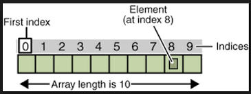

# Funciones Flecha y Arrays

## Funciones de flecha 
Dada la siguiente función `obtenerPersonaMasGrande` que busca la persona más grande entre tres objetos `Persona` pasados por argumentos:
```js
obtenerPersonaMasGrande = function (p1, p2, p3) {
    let mayor = p1;
    if (p2.edad() > p1.edad())
        mayor = p2;
    else {
        if (p3.edad() > p1.edad())
            mayor = p3;
    }
    console.log('Soy una function/metodo común. Atte esMayorDeEdad');
    return mayor;
};
```
Podemos reescribirla como `arrow function`:
```js
obtenerPersonaMasGrandeArrow = (p1, p2, p3) => {
    let mayor = p1;
    if (p2.edad() > p1.edad())
        mayor = p2;
    else {
        if (p3.edad() > p1.edad())
            mayor = p3;
    }
    console.log('Soy una arrow function. Atte esMayorDeEdad');
    return mayor;
};
```

Básicamente las **arrow functions** son otra forma de escribir funciones con una sintaxis más simplificada, lo que normalmente conocemos como **expresadas**. 

Existen algunas diferencias con las funciones declaradas y también algunas
limitaciones, tal como se enuncia a continuación:
- No hay que usar **arrow function** cuando se está declarando metodos dentro de una clase o definición de objetos.
- No se puede usar **arrow functions** dentro de constructores.
- Si tienen solo una línea es posible omitir las {} y escribirla en una sola línea 
- Si tienen un solo parámetro es posible omitir los () 
- Mediante **this** tienen acceso al contexto de su declaración
- Tienen un return implícito
- Son utilizadas dentro los iteradores de conjuntos


>Nota
> 
> Si bien hay más limitaciones, solo se mencionan éstas ya que se relacionan con los puntos abordados hasta el momento. Para mas info ir a 
> [Arrow function expressions](https://developer.mozilla.org/en-US/docs/Web/JavaScript/Reference/Functions/Arrow_functions).


## Arrays o vectores
Un arreglo es un conjunto de datos ordenados por posiciones, asociadas en una variable. Los valores se delimitan por **[]**.
Gráficamente:



Los valores pueden ser del mismo tipo o de distinto tipo. Algunos ejemplos:

```js
const array = ['hola', 3.14, true];
console.log('array:', array); // array: [ 'hola', 3.14, true ]
```

```js
const array = new Array(3); // Crea tres posiciones, donde cada elemento tiene como valor por defecto `undefined`
console.log('array con elementos undefine', array); // array con elementos undefine [ <3 empty items> ]
```

```js
const array = new Array('hola', 3.14, true);
console.log('array:', array); // array: [ 'hola', 3.14, true ]
```

### Manipulando arrays
- Para acceder por índice: `array[0]`= primer elemento. En JS los arreglos son **0-index**. Si se utiliza un número de índice no válido, se obtendrá `undefined`.
- Para añadir un elemento: `array.push(nuevoElemento)`. Siempre se agregan dinámicamente al final sin límite.
- Para añadir al comienzo: `array.unshift(elemento)`. Esto devuelve el número de elementos.
- Para quitar el último elemento `array.pop()`. Esto devuelve el elemento eliminado.
- Para quitar el primer elemento `array.shift()`. Esto devuelve el elemento eliminado.
- Para conocer la cantidad de elementos: `array.length` .  
**Importante**: `length` es una propiedad de los array por lo tanto es sin paréntesis.
Por ejemplo:
```js
const numeros = [1, 35, 6, 54, 13, 3, 24]; // dar nombres representantivos
console.log('array numeros', numeros)
console.log('primero elemento de numeros', numeros[0])
console.log('índice no válido de numeros', numeros[129])
// agrego nuevo elemento al final
numeros.push(65)
console.log('nuevo elemento al final de numeros', numeros[7])
// agrego nuevo elemento al principio de numeros
numeros.unshift(34)
console.log('nuevo elemento al final de numeros', numeros[0])
console.log(`El array números tiene ${numeros.length} elementos`);
```

### Iterando arrays
Podemos usar tanto las estructuras iterativas tradicionales o Javascript nos provee de varios [metodos o funciones especiales](https://developer.mozilla.org/es/docs/Web/JavaScript/Reference/Global_Objects/Array) para manipular arrays. Entre ellos podemos encontrar:
> Todas las funciones especiales ejecutan una función sobre los elementos del array. 
> La sintaxis corresponde a funciones flecha. 
> 
> Notar que la variable auxiliar **e** puede nombrarse como el desarrollador prefiera.

Dado el siguiente array:
```js
const numeros = [1, 35, 6, 54, 13, 3, 24]; // dar nombres representantivos
```
Podemos ejecutar algunos ejemplos en la sección [Iterando arrays](js/array.js#L25)
- **forEach**: Recorrer los cada elemento. Como argumento del forEach va una funcion, por ejemplo
```js
numeros.forEach(elemento => console.log(elemento));
```
> Nota:
> En este caso la arrow function `e => console.log(e)` solo imprime por consola lo que le llega por argumento. 

- **filter**: Filtrar los elementos, devuelve un array nuevo. No modifica el actual.
```js
const mayoresA10 = numeros.filter((e) => e > 10);
console.log(`Mayores a 10`, mayoresA10);
console.log(`Numeros`, numeros);
console.log(`La cantidad de elementos mayores a 10 son ${mayoresA10.length}`);
```
> Nota:
> Notese que la arrow function pasada por parametro a `filter` tiene que retornar `true` para que el elemento e 
> sea insertado en el array que se va a retornar.

- **map**: Mapea cada elemento del array y genera un array nuevo a partir de cada elemento mapeado. Por ejemplo
```js
const numerosX10 = numeros.map((e) => e * 10);
console.log(`elementos mapeados`, numerosX10);
console.log(`Numeros`, numeros);
console.log(`La cantidad de elementos mayores a 10 son ${numerosX10.length}`);
```

- **reduce**: Permite iterar sobre cada elemento del array y acumular el resultado de una operación en una variable, que eventualmente se convertirá en el valor final de reducción.

```js
const numeros = [1, 2, 3, 4, 5];
const suma = numeros.reduce((acumulador, valorActual) => acumulador + valorActual, 0);

// aca el primer parametro es una funcion flecha
// y el segundo parametro es el valor inicial 0

console.log(suma); // Imprime: 15 (1 + 2 + 3 + 4 + 5)
```

## Bibliografía o Referencia

* [JavaScript Guide - Mozilla Developer Network => Introduction](https://developer.mozilla.org/en-US/docs/Web/JavaScript/Guide/Introduction#what_is_javascript)
* [metodos o funciones de arrays](https://developer.mozilla.org/es/docs/Web/JavaScript/Reference/Global_Objects/Array)
* [sort](https://developer.mozilla.org/en-US/docs/Web/JavaScript/Reference/Global_Objects/Array/sort)
* [JavaScript Guide - Mozilla Developer Network => Introduction](https://developer.mozilla.org/en-US/docs/Web/JavaScript/Guide/Introduction#what_is_javascript)
* [Funciones flecha](https://developer.mozilla.org/en-US/docs/Web/JavaScript/Reference/Functions/Arrow_functions)
